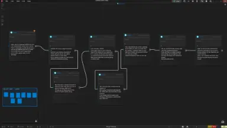
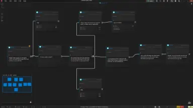
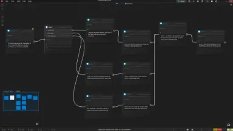
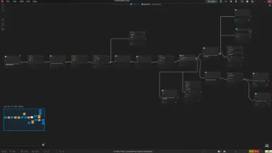
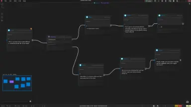
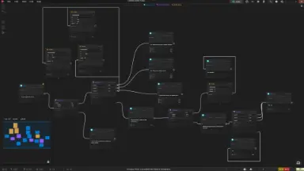

# LSDE Playground with runtime demos

Interactive demos showcasing **[LSDEDE](https://jonlepage.github.io/LS-Dialog-Editor-Engine)** through PixiJS scenes with colored bunny sprites as characters.

Each demo loads an [LSDE](https://lepasoft.com/en/software/ls-dialog-editor) blueprint and renders it in real-time — walk your character, trigger dialogues, make choices, and watch the engine in action.

The demo demonstrates a basic use of the **LSDEDE runtime** and a way to connect it to your game architecture.
The scenes come from **data produced by LSDE**, and the runtime called LSDEDE interprets them in order to map them to your game engine or API.

**[▶ Live Demo](https://jonlepage.github.io/LSDEDE-DEMO-TS/)**

## Demos

| Demo                   | What it teaches                                                         |
| ---------------------- | ----------------------------------------------------------------------- |
| **simple-dialog-flow** | Linear dialogue — walk to an NPC, press Enter, read speech bubbles      |
| **simple-choices**     | CHOICE blocks — pick a moral option, watch the flow branch and converge |
| **simple-condition**   | CONDITION blocks — inventory-based branching (pick up a carrot!)        |
| **simple-action**      | ACTION blocks — camera shake, camera pan, character movement            |
| **multi-tracks**       | Parallel dialogue tracks firing simultaneously                          |
| **condition-dispatch** | Dispatcher mode + party recruitment + follower AI                       |

## Stack

- **[LSDE Dialog Engine Runtime](https://github.com/jonlepage/LS-Dialog-Editor-Engine)** — runtime engine to execute [LS Dialog editor](https://lepasoft.com/en/software/ls-dialog-editor) blueprints data.
- **[PixiJS](https://pixijs.com)** — 2D rendering (simulate custom game engine and rendering)

## demo code

Your can find all demo in [`src/demos/`](src/demos/) folder:

- [simple-dialog-flow](src/demos/simple-dialog-flow)
- [simple-choices](src/demos/simple-choices)
- [simple-condition](src/demos/simple-condition)
- [simple-action](src/demos/simple-action)
- [multi-tracks](src/demos/multi-tracks)
- [condition-dispatch](src/demos/condition-dispatch)

They are only for demonstration purposes and not meant to be production-quality code or best practices for your game engine.
All engine need specific optimizations and architecture decisions, so treat them as educational reference material to understand how to integrate [LSDEDE](https://jonlepage.github.io/LS-Dialog-Editor-Engine) with your custom rendering/game engine

## Architecture

```
src/
├── engine/      → LSDE logic & dispatch (knows nothing about PixiJS)
├── renderer/    → PixiJS rendering (knows nothing about LSDE)
├── game/        → Game state: characters, variables, inventory
├── demos/       → LSDEDE runtime — connects engine + game + renderer
├── app/         → App shell (sidebar navigation + canvas layout)
├── debug/       → Tweakpane debug panel
└── shared/      → utiles, types and constants
```

Strict layer separation: `engine/`, `renderer/`, and `game/` never import from each other. Only `demos/` composes them together.

## Links

- **LSDE Editor** — [lsde.lepa-dialog.com](https://lepasoft.com/en/software/ls-dialog-editor)
- **npm package** — [@lsde/dialog-engine](https://www.npmjs.com/package/@lsde/dialog-engine)

## Demo Blueprint Screenshots

<table>
  <tr>
    <td align="center"><a href="https://jonlepage.github.io/LSDEDE-DEMO-TS/lsde-blueprint-1.webp"><br><b>simple-dialog-flow</b></a></td>
    <td align="center"><a href="https://jonlepage.github.io/LSDEDE-DEMO-TS/lsde-blueprint-2.webp"><br><b>multi-tracks</b></a></td>
    <td align="center"><a href="https://jonlepage.github.io/LSDEDE-DEMO-TS/lsde-blueprint-3.webp"><br><b>simple-choices</b></a></td>
  </tr>
  <tr>
    <td align="center"><a href="https://jonlepage.github.io/LSDEDE-DEMO-TS/lsde-blueprint-4.webp"><br><b>simple-action</b></a></td>
    <td align="center"><a href="https://jonlepage.github.io/LSDEDE-DEMO-TS/lsde-blueprint-5.webp"><br><b>simple-condition</b></a></td>
    <td align="center"><a href="https://jonlepage.github.io/LSDEDE-DEMO-TS/lsde-blueprint-6.webp"><br><b>condition-dispatch</b></a></td>
  </tr>
</table>
